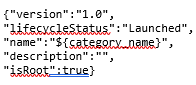

# Business API Framework: test cases description #

The scenarios defined for stress testing are taken as example of a data written to database.

- `Create new Catalog`
- `Create new Category` 

## Test Case 1.- Stress Scenario 1 – Create new Category ##

The goal of this scenario is to assess system performance with a high load in a short period of time. In this test we login on Keyrock to access to Business API framework, the same operation is realized to logout, so there is comunnication between both.

There are three types of requests in this script. The first one creates a rule, then a subscription to that rule is done and finally we unsubscribe the previous rule.We add one thread every four seconds to reach 300 and the scenario’s duration is 40 minutes

|ID	| GE API method	| Operation	| Type	| Payload	| Max. Concurrent Threads |
|---|:--------------|:----------|:------|:----------|:------------------------|
| 1 | /oauth2/authorize?response_type=code&client_id={client_id}&state={state}&redirect_uri=http://proxy.docker:8004/auth/fiware/callback	 |  Login on Keyrock	| POST	|  | 100 |
| 2 | /DSProductCatalog/api/catalogManagement/v2/category	 | Create new Category | POST |  |100 |
| 3 | /logout	 |	Logout | POST | None  | 100 |

Regarding the variables

- **email**: Admin email to login on Keyrock.
- **pass**: Admin pass for the email to login on Keyrock.
- **category_name**: Name for the new Category.

## Test Case 2.- Stress Scenario 2 – Create new Catalog ##

It's analogous to the test case 1. The only difference is that we are creating a new Catalog instead of Category.

## Test Case 3.- Stability Scenario - Create new Catalog and Category (at the same time) ##

The goal of this scenario is to check if the system is degraded with a moderate load for a long period of time. This case is composed by the two previous test cases: Create a category and catalog at the same time. The difference is that it's stability test not a stress one.

The test adds two thread (user) every 30 seconds to reach 40 users and it is running for 6 hours. 

Actors and requests are the same than in the first and second test cases so it's not needed to explain them again.
