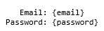
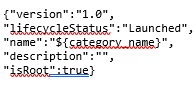

# Business API Framework: test cases description #

The scenarios defined for stress testing are taken as example of a data written to database.

- `Create new Catalog`
- `Create new Category` 

## Test Case 1.- Stress Scenario 1 – Create new Category ##

The goal of this scenario is to assess system performance with a high load in a short period of time. In this test we login on Keyrock to access to Business API framework, the same operation is realized to logout, so there is comunnication between both.

There are three types of requests in this script. The first one creates a rule, then a subscription to that rule is done and finally we unsubscribe the previous rule.We add one thread every four seconds to reach 300 and the scenario’s duration is 40 minutes

|ID	| GE API method	| Operation	| Type	| Payload	| Max. Concurrent Threads |
|---|:--------------|:----------|:------|:----------|:------------------------|
| 1 | /oauth2/authorize?response_type=code&client_id={client_id}&state={state}&redirect_uri=http://proxy.docker:8004/auth/fiware/callback	 |  Login on Keyrock	| POST	|  | 100 |
| 2 | /DSProductCatalog/api/catalogManagement/v2/category	 | Create new Category | POST |  |100 |
| 3 | /logout	 |	Logout | POST |  | 100 |

Regarding the variables

- **email**: Admin email to login on Keyrock.
- **pass**: Admin pass for the email to login on Keyrock.
- **category_name**: Name for the new Category.

## Test Case 2.- Stress Scenario 2 – Create new Catalog ##

It's analogous to the test case 1. The only difference is that this time the Security level parameter has been configured to “low”, and the log file to “info”.

## Test Case 3.- Stability Scenario ##

The goal of this scenario is to check if the system is degraded with a moderate load for a long period of time. This case is analogous to test case 2 the difference is that it's stability test not a stress one.

The test adds one thread every ten seconds to reach 30 and lasts 6 hours. 

Actors and requests are the same than in the first test case so it's not needed to explain them again.

## Test Case 4.- Facts Stress Scenario ##

Stress scenario, similar to the test cases 1 and 2, but this time, a fact is sent to the Facts component.

The actors that are involved are the same than the ones that have been used during all the cases.

There is just one type of request that simulatse the operation that the context broker used to send data to the Policy Manager 

|ID	| GE API method	| Operation	| Type	| Payload	| Max. Concurrent Threads |
|---|:--------------|:----------|:------|:----------|:------------------------|
| 1 |	v1.0/${TENANT}/servers/${SERVER} |  Fact sending	| POST	|  | 300 |

The variables are explained in the first test case.

## Test Case 5.- Facts Stability Scenario ##

This scenario is similar to the test case 3, but using the same facts scenario than in the test case 4.

The test adds one thread every 60 seconds to reach 30 and lasts 6 hours. 
