# FogFlow: test cases description #

The scenarios defined for testing are taken as example of a data written to database, querying and deletion.

- `Stress`
- `Stress only update`
- `Stability` 

## Test Case 1.- Stress Scenario ##

The goal of this scenario is to assess system performance with a high load in a short period of time. In this test we all services provided in API. 

There are different types of requests in this script: Creation of a Context, Query, Subscription and Deletion. The first one creates a new device with set attributes, then you can query and subscribe it to receive information. Finally the last request can delete them.

We add two threads every 6 seconds to reach 100 and the scenario’s duration is 25 minutes

|ID	| GE API method	| Operation	| Type	| Payload	| Max. Concurrent Threads |
|---|:--------------|:----------|:------|:----------|:------------------------|
|1  | /ngsi9/discoverContextAvailability | Look up for Nearby Brokers | POST | 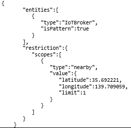 | 25|
|2  | /ngsi10/updateContext  | Create a new context | POST | 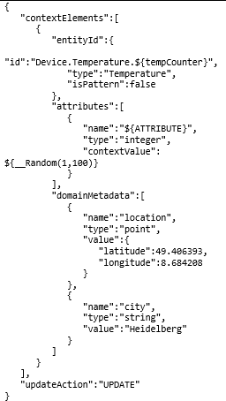 | 25|
|3  | /ngsi10/entity/Device.Temperature.${tempCounter} | Get all info about specific entity | GET | None  | 25|
|4  | /ngsi10/entity/Device.Temperature.${tempCounter}/${ATTRIBUTE} | Get info for specific parameter in specific entity | GET | None | 25|
|5  | /ngsi10/entity | Get all info for all entities | GET | None | 25|
|6  | /ngsi10/queryContext | Query for one or more entities by ID | POST | 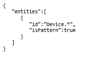 | 25|
|7  | /ngsi10/queryContext | Query for one or more entities by Type | POST | 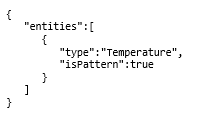 | 25|
|8  | /ngsi10/queryContext | Query for one or more entities by GeoScope | POST | 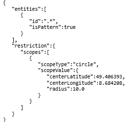 | 25|
|9  | /ngsi10/queryContext | Query for one or more entities by MetadataValues | POST | 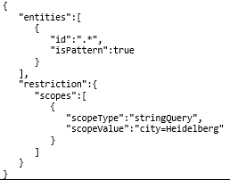 | 25|
|10 | /ngsi10/queryContext | Query for one or more entities by MultipleFilters | POST | 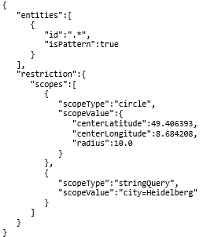 | 25|
|11 | /ngsi10/subscribeContext | Subscribe context by ID | POST | 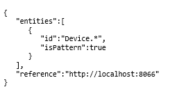 | 25|
|12 | /ngsi10/subscribeContext | Subscribe context by Multiple filters | POST |  | 25|
|13 | /ngsi10/subscribeContext | Subscribe context by Type | POST | 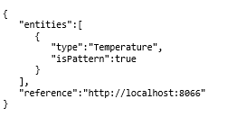 | 25|
|14 | /ngsi10/subscribeContext | Subscribe context by GeoScope | POST | 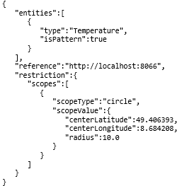 |25|
|15 | /ngsi10/subscribeContext | Subscribe context by Metadata values | POST | 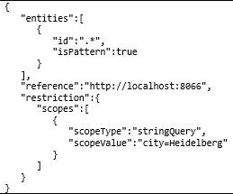 | 25|
|16 | /ngsi10/subscription/${subscriptionId} |  Delete specified context by ID | DELETE | None | 25|
|17 | /ngsi10/entity/Device.Temperature.${tempCounter} | Delete specific entity by ID | DELETE | None | 25|

Regarding the variables

- **HOST** -> IP or hostname of the host where FogFlow is deployed.
- **PORT** -> Port where FogFlow/Broker is listening.
- **ABSOLUTE_PATH** -> Path for jmx and csv files.
- **ATTRIBUTE** -> Attribute variable to set when a new context is created or modified.
- **tempCounter** -> Counter to generate ID's for new contexts.

## Test Case 2.- Stress only update ##

This test only covers the behavior of the system with the "updateContext" service, where system should only update the attributes of a devices created before.

|ID	| GE API method	| Operation	| Type	| Payload	| Max. Concurrent Threads |
|---|:--------------|:----------|:------|:----------|:------------------------|
|1  | /ngsi10/updateContext  | Create a new context | POST |  | 25|

The load is set to 200 users, with a thinktime between requests of 5 ms and the same ramp-up and duration as the first stress scenario, 20 minutes for ramp-up and 25 minutes of total lenght.

## Test Case 3.- Stability Scenario ##

It's analogous to the test case 1.

The only difference is the load and time set. In this case, we set 25 users (1 user every 7.2 seconds), for 6 hours.